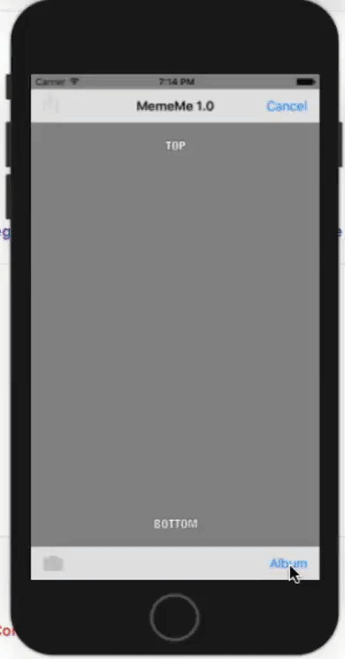
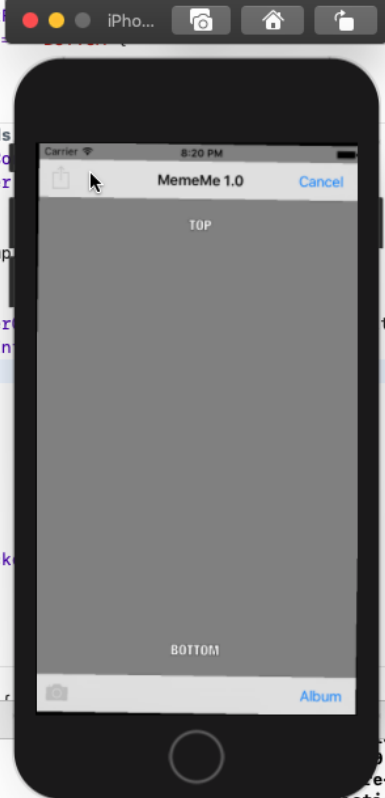
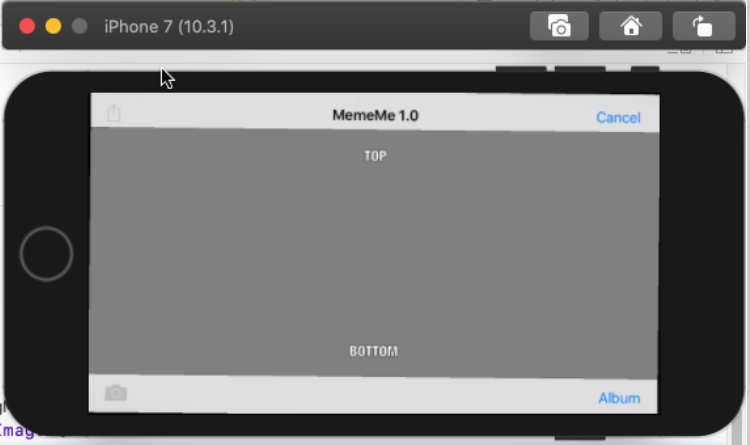

   

# MemeMe-1.0_Udacity
With this first version of MemeMe, students will create an app that enables a user to take a picture, and add text at the top and bottom to form a meme. The user will be able to share the photo on Facebook and Twitter and also by SMS or email.

# Why MemeMe-1.0
MemeMe covers many of the major UI components found in essentially every app. It combines them with the camera and social media activity view to create a fun and personal user experience.

